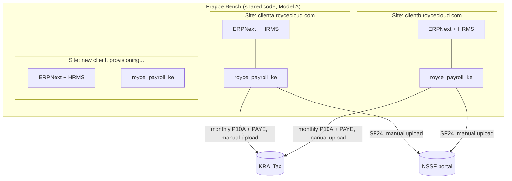
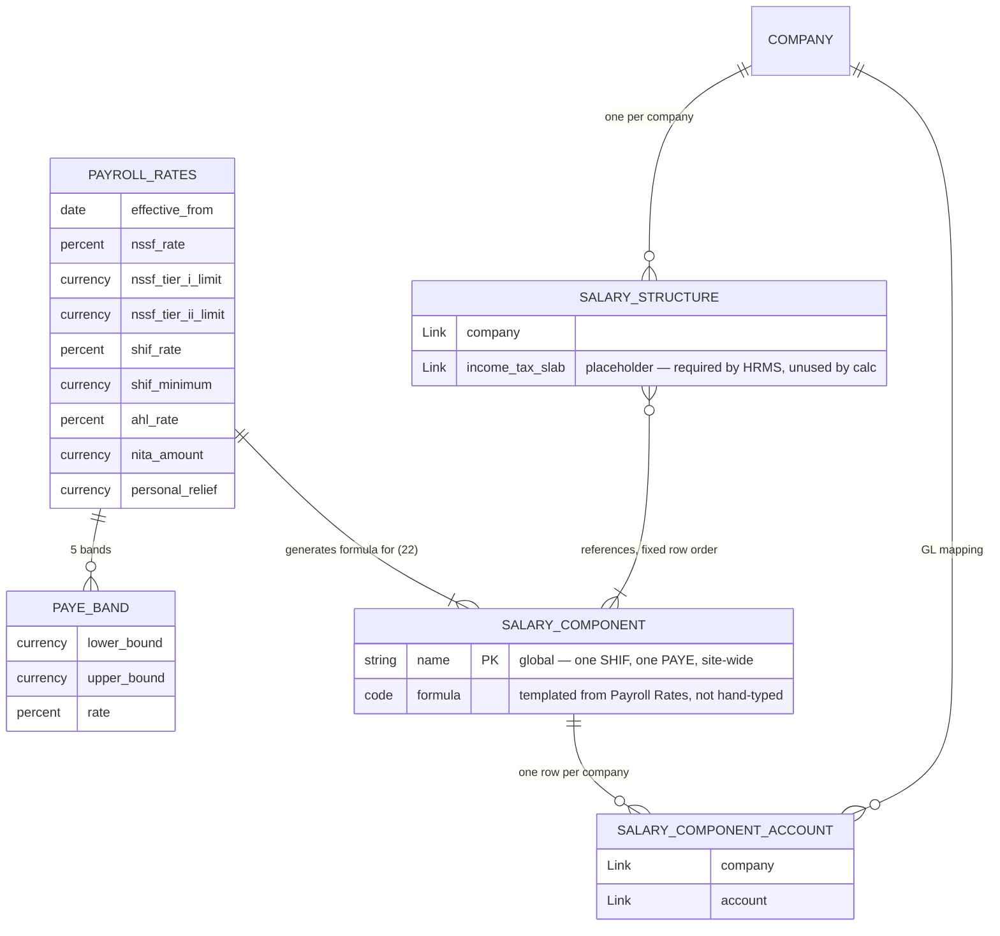
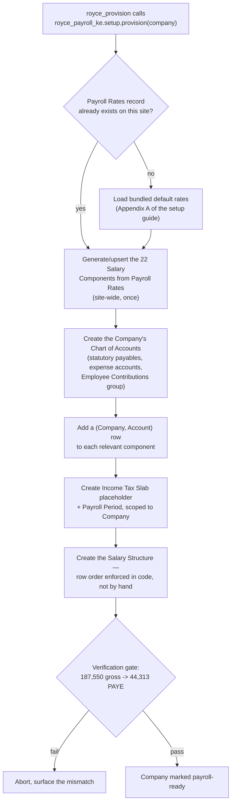
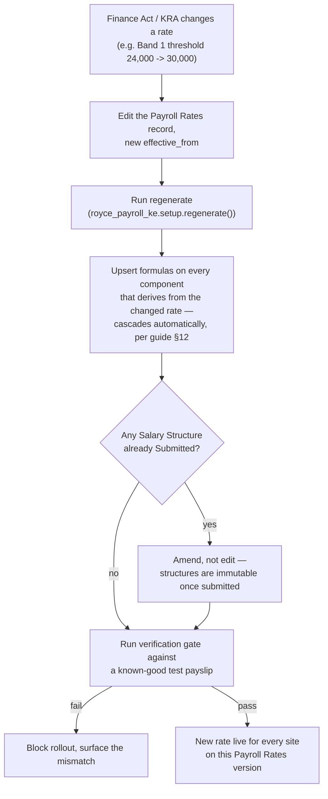

# Royce Payroll KE — Architecture Reference

Status: **implementation started**. Captures the decisions made so far so we don't re-litigate
them. Update this file as decisions change — it's meant to stay current, not to be a one-time
snapshot.

**Built and verified so far:** the `Payroll Rates` doctype + child table, the two Salary Component
classification fields, and the generator (`royce_payroll_ke.royce_payroll_ke.setup` —
`provision(company)` and `regenerate()`). All installed and exercised on a real site
(`mytesterp.localhost`, which also has `hrms` and the old `csf_ke` on it):

- `Payroll Rates` round-trips correctly through `get_effective()`; malformed records (wrong band
  count, non-contiguous bounds) are correctly rejected by `validate()`.
- `provision()` ran end to end against the real "Royce Technologies LTD" company already on that
  site — created the Chart of Accounts, all 22 Salary Components with formulas templated from the
  rates record, the Income Tax Slab placeholder, and the Salary Structure (reusing the site's
  existing Payroll Period rather than duplicating it — the idempotency check works).
- Assigned the structure to the real employee the guide's own worked example uses
  (`HR-EMP-00001`) and generated an actual Salary Slip for May 2026. Independently hand-computed
  the whole chain in plain Python from the guide's own formulas before trusting either number.

**Finding: the guide's own Section 11 worked example has a 50 KES arithmetic error.** It states
Gross Pay as 187,550, but its own three listed earnings (150,000 + 22,500 + 15,000) sum to
187,500 — the 50 KES gap exactly equals NITA's flat amount, which cannot legitimately belong in
gross pay (it's an employer-side levy, structurally excluded from employee totals by the guide's
own design). The generator's output — Gross Pay 187,500, PAYE 44,299, Net Pay 128,753 — matches an
independent hand-calculation of the guide's formulas exactly. The guide's stated "expected" figures
(PAYE 44,313 etc.) all inherit the same 50 KES slip. Verified correct against the formulas, not
against that table.

**Third real bug, found the same way — via `etims.localhost`, a second real company, not
`mytesterp.localhost`:** `ensure_accounts()` only checked whether `Payroll Payable` *existed*
before deciding whether to create it. ERPNext auto-creates that account at company setup — so it
already existed on this company, with a blank Account Type, and `provision()` silently skipped
fixing it. HRMS's Payroll Entry refused to disburse against it ("Account type should be set
Payable"), caught only when actually running a Payroll Entry through to that step, not by
inspecting the provisioning code. Fixed: every account `ensure_accounts()` touches — the 9
statutory/expense accounts and Payroll Payable alike — now verifies its Account Type even when it
already exists, and corrects it if wrong. Proved the fix, not just written it: deliberately
blanked the account type again, re-ran `provision()`, confirmed it self-healed without manual
intervention.

**Fourth finding, this one caught before it shipped rather than after:** while implementing the
`regenerate()`-doesn't-cascade gap flagged in the user guide, checked the actual HRMS source rather
than assume — `eval_condition_and_formula` reads `struct_row.condition` / `struct_row.formula`
directly off the Salary Structure's own row, never the live Salary Component master. Confirmed the
gap was real. Rejected the obvious fix (cancel-and-amend the stale structure in place) because it
risks stranding any Salary Structure Assignment already pointing at it. Fixed instead by naming
each Salary Structure after the exact Payroll Rates version it was built from
(`{ABBR} Payroll Structure {rates.name}`, not `{year}`) — a new rate, whether next year or a
mid-year Finance Act amendment, always gets its own distinctly-named structure, and nothing ever
needs to be cancelled or amended. `regenerate()` now also rebuilds the structure for every
already-provisioned company automatically (detected via the `Taxable Income` marker component, not
a naming convention, so it still finds them even if renamed) — proved live on `etims.localhost`:
ran `regenerate()` against a second rates version, confirmed the old structure's `modified`
timestamp, docstatus, and formulas were completely untouched, and that a new, correctly-named
structure appeared alongside it. User guide section 7 rewritten to match — the "known limitation"
callout that used to live there is gone because the underlying bug is gone, not because it was
reworded around.

**Fifth finding:** modern Frappe (v16) rejects raw SQL fragments like `"sum(amount)"` passed as a
field name to `frappe.db.get_value()` — a query-sanitizer hardening that broke on the first live
test, not something apparent from the code. Fixed by using the Query Builder's `Sum()` function
properly instead of a string shortcut. Worth remembering for any future report code in this app.

**Built and verified since:** four Employee fields (`royce_national_id`, `royce_kra_pin`,
`royce_nssf_no`, `royce_shif_no` — namespaced the same way as the Salary Component fields, for the
same reason), and three of the five reports — NSSF, SHIF, and Housing Levy Contributions. All
three share one query helper (`report_utils.statutory_component_report`) rather than duplicating
near-identical logic three times. Tested against a real submitted Salary Slip (not seeded data —
the one the user's own Payroll Entry testing produced) and hand-verified every number: NSSF 3,750
(540 + 3,210), SHIF 1,719 (62,500 × 2.75%, rounded), Housing Levy 1,876 (938 + 938, employee and
employer sides — deliberately both, since `Housing Levy Payable` accumulates both together and a
report showing only the employee side wouldn't reconcile against it).

**Built and verified since: P9A and P10A, both compliance-critical.** P10A (monthly return) and
P9A (annual certificate, with a real PDF via `get_pdf()` — this is a document handed to an
employee, not just a screen report) both share a new `report_utils.card_type_sums()` helper:
generic aggregation by P9A/P10A classification, same proven pattern as the single-component
reports, reusable across both.

**Sixth finding, and this one would have shipped a silently-wrong report if trusted instead of
checked:** planned to read `Taxable Income` and `Gross PAYE` directly off Salary Detail for the
P9A's "Chargeable Pay" / "Tax Charged" columns, the same way the other reports read real
components. Checked the HRMS source first — `add_structure_component`'s statistical-component
branch never calls `update_component_row`; its own comment says so directly ("row for statistical
component is not added to salary slip"). **Statistical components are never persisted as Salary
Detail rows at all** — they exist only as in-memory values during calculation. Querying for them
would have silently returned zero on every P9A ever generated. Fixed by deriving both values
arithmetically from what *is* persisted instead — `slip.gross_pay` minus the real NSSF/SHIF/Housing
Levy rows for Chargeable Pay, PAYE Tax plus Payroll Rates' Personal Relief for Tax Charged — the
same relationships the generator itself uses, not a workaround. One honest, documented residual
limitation: an employee whose Gross PAYE fell below the relief threshold has PAYE = 0 with no
persisted trace of the true pre-relief figure (the component's own `Condition` prevents it from
being created at all in that case) — Tax Charged for that specific edge case is a reasonable
derivation, not an exact one.

**Also fixed while building this:** `frappe.db.get_value(..., "sum(amount)")` was already known
broken (fifth finding) — the same Query Builder `Sum()` pattern was used throughout from the start
this time, not rediscovered.

Both reports verified against the same real August 2026 slip used throughout this doc, hand-traced
independently, and the P9A's actual rendered PDF was read back and visually confirmed correct —
right header, right row populated, right totals, other 11 months correctly zero.

Still not built: the `royce_provision` orchestration app, the bank fields (deferred — not needed
until the Bank Advice report), and the access-structure work from the previous session (own
workspace polish, a Desktop Icon matching `royce_talk`/`royce_etims`, self-healing pointer cards in
`Payroll` and `Accounting` for HR and Finance respectively) — deliberately set aside this session in
favour of the two compliance-critical reports, per explicit CTO-level prioritisation: a report KRA
expects and the app can't produce isn't a discoverability problem, it's a compliance gap.

## Session 3 — closing two remaining gaps in "compliant," not adding features

Explicit CTO framing for this session: "working as expected and compliant," not new functionality.
Two things stood out as unfinished against that bar, neither of them `royce_provision` or
discoverability.

**A P9A could previously be generated for an employee with no KRA PIN on file.** Fixed:
`download_certificate()` now hard-blocks with a clear message if `royce_kra_pin` is blank, rather
than silently issuing an incomplete certificate. Deliberately not made a mandatory field on
Employee itself — that would block ordinary employee setup for a requirement that only actually
matters at certificate time. Verified both directions, not just the code path: blanked a real
employee's PIN, confirmed the block fires with the right message, restored it, confirmed the PDF
generates normally again.

**Everything verified before this session was against exactly one employee, one slip, one month.**
That's proof the formulas are right, not proof the reports work at the scale a real payroll run
actually has. Built a genuine two-employee test — different base salaries (150,000 and 80,000),
run through an actual `Payroll Entry` end to end, all five reports checked against both employees
independently.

**This surfaced a real near-miss, caused by the test process itself, not the app — but worth
recording in full because of what it revealed about a mechanism this app depends on.** An earlier,
broken run of the test script (fixing API mistakes — wrong field name, wrong method name — across
several attempts) left stale **Draft** Salary Slips behind. A later, corrected run then created a
second `Payroll Entry` for the same period, and `Payroll Entry`'s own duplicate-prevention
(`remove_payrolled_employees`) only excludes employees who already have a **Submitted** slip for
that exact period — drafts don't count. Combined with a too-broad submission loop in the test
script itself (submitting every draft matching the period, not just the ones the current entry
created), this produced four submitted slips — two real, two duplicates — for two employees, before
it was caught. Root-caused by reading `remove_payrolled_employees`'s actual query rather than
guessing, confirmed the mechanism does correctly block against *submitted* duplicates (the real
risk a client would hit), cleaned up fully, and reran correctly. Worth remembering: this exclusion
is real and does work, but its boundary is "submitted," not "exists" — a Draft slip left over from
an aborted run provides no protection on its own.

Rerun cleanly, every number for both employees across all five reports matched an independent
hand-calculation exactly — including a full reconciliation trace for HR-EMP-00001 that produced the
same 44,299 PAYE this app has now verified three separate times, from three different entry points,
across two different sites.

**Caught after the fact: NITA was modeled but never reported.** The component has existed since
the generator was first built — employer-paid, flat 50/employee/month, posting to `NITA Payable`
— and it's on Appendix A's own submission calendar ("NITA levy — 10th of following month"), same
as NSSF/SHIF/Housing Levy. It should have been in the original batch of five reports and wasn't —
a genuine miss, not a deferral (unlike HELB, bank reports, and the rest, which were named and
explicitly deferred at the time `csf_ke`'s payroll slice was absorbed). Fixed: **Kenya NITA
Contributions**, same shared `statutory_component_report` helper as NSSF/SHIF, verified against the
real June 2026 two-employee data — both employees correctly show the flat 50 regardless of gross
pay.

**HELB raised and deliberately not built yet.** Real, common, and legally mandatory once HELB
issues a deduction notice for a specific employee — but per-employee and HELB-specified in amount,
not a formula derived from gross pay, making it structurally closer to the guide's own Welfare
Contribution pattern (flat, per-employee, via Additional Salary, not in the default Salary
Structure) than to NSSF. Needs a new Salary Component and an Employee reference-number field before
a report makes sense — a modeling decision, not just a report — held for explicit go-ahead rather
than built alongside NITA. Confirmed no current client has this need; parked accordingly, not
built speculatively.

## Session 4 — discoverability, revisited with a corrected priority

Reconsidered the standing priority order out loud rather than default to it: `royce_provision`
makes onboarding the *next* client easier, but discoverability makes the six reports already built
and verified usable by the people at the *current* one, today. Re-ranked discoverability above
`royce_provision` on that basis and built it first.

**First, a wrong assumption caught before building on it:** had been describing "the auto-generated
Royce Payroll Ke workspace" as if it were a real, persisted `Workspace` document. Checked before
touching it — there was no `Workspace`, no `Workspace Sidebar`, nothing in the database at all for
this app. What the earlier screenshot showed was Frappe's dynamic module-index rendering, not a
stored document. Would have tried to "polish" something that didn't exist.

**Built for real instead**, matching `royce_talk`'s own committed pattern exactly rather than
reverse-engineering HRMS's more complex one: a `Workspace` (header, shortcuts to Payroll Rates and
the two annual/monthly reports, a Setup card and a Statutory Reports card covering all six), a
`Workspace Sidebar` (Home, a Setup section, a Reports section), and a `Desktop Icon` (`accounting`
glyph — the same one HRMS's own Payroll icon uses, semantically correct — `gray` background,
deliberately different from `royce_talk`'s `blue` for visual distinction in the app switcher; also
discovered `bg_color` only has two valid values in this Frappe version, `gray` and `blue`, not
assumed). All three hand-authored as fixture files and imported via `bench migrate` — the safe
direction, unlike editing a live document — then verified by reading the actual database content
back on **two separate sites**, confirming this travels with the app rather than being a
one-site fluke. Also explicitly checked every sibling app's git tree stayed clean afterward, since
that's exactly what went wrong the first time this was attempted against HRMS's own workspace.

Not done yet: the self-healing pointer cards in `Payroll` (HR) and `Accounting` (Finance) — the
third piece of the original three-part plan. This session's own workspace is real and complete;
that part is still outstanding.

**The Desktop Icon initially rendered as a bare letter avatar, not a glyph — traced to the actual
frontend code, not guessed at.** `desktop_icon.html`'s render logic never uses the `icon` field
name as a visual glyph at all — that field is only exposed as a data attribute. Real rendering
happens either through `get_desktop_icon()` (a convention-based per-app icon lookup keyed off the
label) or through `logo_url` pointing to an actual image; everything else falls through to a
letter-avatar fallback, which is what was showing. Fixed by extracting the exact "accounting" path
data from Frappe's own icon sprite (`frappe/public/icons/timeless/icons.svg`) — so it stays
visually consistent with HRMS's own Payroll icon, which uses the same glyph — and rebuilding it as
a self-contained, brand-colored two-layer badge SVG (tinted rounded square + solid glyph, teal
rather than HRMS's green), matching the actual pattern HRMS ships for its own icons, not a
themed/`currentColor` line icon (confirmed by reading `hrms`'s own shipped SVG directly rather than
assumed) — a plain `` tag doesn't inherit page theming, so a self-contained color was the
correct choice, not a shortcut.

**Second, separate bug: editing an already-synced fixture file doesn't reliably propagate via
`bench migrate` alone.** Updated the Desktop Icon fixture to add `logo_url`, ran `migrate`, and the
database record didn't change. Traced to `frappe/model/sync.py` and `import_file.py` rather than
guessed at: fixture sync compares the file's own `modified` timestamp against the database
record's, and skips re-importing if the database is already at or past that timestamp. The edit
added a new field but left `modified` unchanged from the first import — the file was, by its own
declared timestamp, indistinguishable from what was already applied. Fixed the live records
directly on both sites, then fixed the actual fixture (bumped `modified`), then **proved** the fix
rather than trusted it: blanked the field in the database again, ran `migrate`, confirmed it
self-healed from the corrected fixture. Worth remembering for any future fixture edit in this app,
not just this one: **bump `modified` by hand whenever hand-editing an already-synced fixture file,
or the change silently won't apply to a site where the old version already ran.**

## Session 5 — Bank Payroll Advice, on request, with notes taken from `navari_csf_ke`

Studied `navari_csf_ke`'s current implementation in full before building — not the diff seen a few
sessions back, the actual current file. Kept its genuinely good ideas (bank code/branch code as
real columns, per-bank subtotals in the report summary, since a real advice file gets split per
bank before submission) and deliberately diverged on one design point: `csf_ke` copies bank fields
onto the Salary Slip at creation time via a `doc_events` override; this version reads them straight
off Employee instead. A bank advice report generates the payment file for the *current* run, so
the employee's *current* bank details are what's wanted — copying them onto historical slips adds
a sync mechanism, and a way for it to drift, to solve a problem this report doesn't have.

Three new Employee fields (`royce_bank_branch_name`, `royce_bank_code`, `royce_branch_code` —
`bank_name` and `bank_ac_no` are already core ERPNext, verified before assuming, same discipline as
every other field added in this app), namespaced the same way as everything else. Verified against
real data: both test employees given real bank details, net pay for both matched this session's
own earlier hand-verified deduction figures exactly (128,753 and 70,442), and the per-bank summary
grouped and totalled correctly.

Also added to the workspace and sidebar this time *with* the modified-timestamp lesson already
applied, not relearned — checked it landed correctly on the first `migrate`, not after a second fix.

Seven reports now exist. Still not built: `royce_provision`, HELB (parked, no client need), and the
HR/Payroll + Finance/Accounting pointer cards from the discoverability plan.

## Session 6 — `royce_provision`, and the verification gate that should have shipped with it

Before building the orchestrator, closed a real gap it depends on: **there was no verification gate
actually shipped in `royce_payroll_ke` at all** — every check across every prior session was an
ad-hoc scratch script, not something `royce_provision` (or anyone else) could call. Built
`verify(company)`: a read-only structural check (all 22 components exist with formulas, every
account has the right Account Type, the current Salary Structure has the right rows in the right
order) — deliberately *not* a synthetic payslip. A real onboarding gate has to be safe to run
against a real client's site, and leaving a fake test employee's payslip in someone's production HR
system to prove a point isn't acceptable.

**First real run immediately found genuine, pre-existing drift, not a manufactured example.**
`mytesterp.localhost` had a blank Account Type on `Housing Levy Payable` and a Salary Structure
still under the old year-based naming — both predating fixes from earlier this session, never
retroactively applied because nothing had re-run `provision()` there since. Investigated before
fixing, confirmed the cause, then used the remedy the design already provides: ran `provision()`
again. Self-healed both, `verify()` passed cleanly afterward with all 22 components checked.
`etims.localhost` was already clean — checked, not assumed, given the two sites' independent
history.

**Then proved `verify()` actually catches problems, not just confirms the happy path**: broke an
account's type and deleted a component's formula simultaneously, confirmed it reported *both* in
one message rather than stopping at the first, restored, confirmed it passed again.

**Checked what `royce_provision` would actually be orchestrating before designing it, rather than
assume `royce_etims` was ready.** It isn't — no `provision()`-style entry point exists there yet,
and its own architecture doc is explicit that KRA registration needs a human entering a real TIN
and Apigee credentials, so it can never be a no-input call the way payroll is. `royce_provision`
built to fully orchestrate `royce_payroll_ke` now, with a clean, documented extension point for
`royce_etims` rather than a stub pretending it works.

**Tried and deliberately abandoned: injecting this app's reports into HRMS's own `Payroll`
workspace.** Wanted, for discoverability — sitting next to Salary Register / Income Tax
Deductions rather than only in a separate `royce_payroll_ke` workspace. Built it as an additive,
idempotent function (new card appended at the end, HRMS's existing cards/links never touched) and
it worked at the database level. But live-testing it surfaced two real problems, not hypothetical
ones: (1) on a bench with `developer_mode` on, saving a "standard" document like this workspace
auto-exports it back to the *owning app's own file on disk* — this genuinely modified `hrms`'s
tracked `payroll.json`, confirmed via `git status`. (2) Worse, and true regardless of
`developer_mode`: `bench migrate` re-syncs standard documents *from* each app's shipped file back
*into* the database — meaning a DB-only customization to another app's workspace is not stable,
it's borrowed time until the next migrate silently reverts it. Reverted both the file (`git
checkout`) and the DB change (confirmed via diff that no trace was left, only a harmless JSON
key-ordering/timestamp artifact, itself then reverted) and removed the function from the codebase
entirely — not left in as dead code, since leaving it would invite someone to call it later
without knowing why it was abandoned. The auto-generated `Royce Payroll Ke` workspace (ships with
this app, owned by it, immune to this whole class of problem) stays the answer for "where do I
find these reports."

Source of truth for the calculation itself: `Royce_Payroll_Setup_Guide_v16_v2.1.pdf` (the manual
runbook this app replaces). Nothing about the PAYE math changes here — the 22-component band
approach, the checkbox flags, the row order — this app just stops it from being hand-typed per
client. See the Compliance Cloud architecture note for the tenancy/onboarding reasoning this doc
assumes as settled.

## Decisions locked so far

- **Tenancy:** one Frappe **site per client** (Model A), all on the same bench. Chosen over a
  shared multi-company site specifically for payroll: a permission-config mistake on statutory pay
  data should stay scoped to one client, not leak site-wide.
- **App independence:** `royce_payroll_ke` and `royce_etims` are separately installable and know
  nothing about each other. A third app, working name `royce_provision`, does Royce-Cloud-only
  onboarding bundling and is never installed on a client's site — only on Royce's own control
  plane.
- **Self-provisioning:** this app owns its own idempotent entry point,
  `royce_payroll_ke.setup.provision(company)`. It has to work standalone with zero help from
  Royce, because a self-hosted client (Provision 2) installs this app with nobody else in the
  loop.
- **Calculation approach unchanged:** band-based PAYE via 22 salary components, not ERPNext's
  native Income Tax Slab engine. The guide's v1.0 → v2.0 changelog documents why: the slab engine
  annualises, applies relief against taxable income instead of computed tax, and produces PAYE
  that drifts from KRA's monthly figure as the year progresses. The Income Tax Slab doctype is
  still created — empty — purely to satisfy HRMS's validation rule that one be linked.
- **Salary Component is a global, site-wide master.** Verified directly against the installed
  `hrms` app (no `Company` field on the doctype; it's named by the component itself). The 22
  components get created **once per site**, not once per client. Only the `Accounts` child-table
  row on each component, `Salary Structure`, `Salary Structure Assignment`, `Payroll Period`, and
  the `Income Tax Slab` placeholder are per-`Company`.
- **Source of truth for rates:** a new `Payroll Rates` doctype replaces Appendix A's numbers
  currently hand-copied into up to 15 components. The generator templates every dependent
  component's formula off it.
- **Rate changes go through regenerate, not hand edits.** Editing `Payroll Rates` and re-running
  the generator replaces the guide's §12 sequence — cascading edits across every band whose lower
  bound depends on the changed threshold, done by hand, in exact order, with no safety net but
  "test before rolling out."
- **The guide's worked example is the safety net, automated.** 187,550 gross → 44,313 PAYE, run as
  a real test after every provision and every regenerate. A provisioning run or a rate rollout that
  fails it does not complete.
- **Onboarding trigger, v1:** Royce staff, by hand, via a `bench` command. No self-serve, no admin
  UI yet — `royce_provision` calls this app's `provision()` directly.
- **Reversed: `csf_ke` is not a dependency. Its payroll-relevant slice gets absorbed instead.**
  Audited its full footprint on HRMS doctypes, not just Salary Component: 9 custom fields on
  Employee (`national_id`, `nssf_no`, `nhif_no`, `tax_id`, `bank_branch_name`, contract/probation
  dates, plus a stray duplicate `custom_nssf_no`), 2 on Salary Component (the P9A/P10A
  classification selects), 1 on Employee Separation, and ~9 reports built on top (P9A, P10, NSSF,
  SHIF, a legacy NHIF duplicate, HELB, Housing Levy, Bank Payroll Advice, Payroll Register) — each
  a straightforward join over Employee / Salary Slip / Salary Detail, none touching PAYE
  calculation. That's the entire payroll-relevant footprint; everything else in csf_ke's ~10,300
  lines (ETR fields, packing lists, price margins, SMS center, VAT/withholding reports) is
  unrelated and would be dead weight on every client site if pulled in just for this slice.
  Decision: port the fields and the statutorily-deadlined reports (P9A, P10A/PAYE, NSSF, SHIF,
  Housing Levy — per Appendix A's own submission calendar) directly into `royce_payroll_ke`. HELB
  and the bank/register reports aren't on that calendar; they can follow later. `csf_ke` is not
  listed in `required_apps`. Compliance reporting is core to the product being sold, not
  infrastructure worth outsourcing to a third-party GPL dependency. Before cutover, diff output
  against `csf_ke`'s reports on the same payslip data rather than trust a fresh port blindly on
  statutory numbers.
- **The two Salary Component fields are `royce_p9a_tax_deduction_card_type` and
  `royce_p10a_tax_deduction_card_type` — not csf_ke's bare `p9a_tax_deduction_card_type` /
  `p10a_tax_deduction_card_type`.** Found by actually installing on a site that still had the old
  `csf_ke` on it, not by inspection: `p10a_tax_deduction_card_type` was already claimed there,
  and install failed with "A field with the name already exists." Since `royce_payroll_ke` has to
  install standalone on any site regardless of what else is or isn't present — a clean site, a
  site mid-migration off `csf_ke`, a self-hosted Provision 2 site — the fields are namespaced to
  guarantee that's always true, at the cost of no longer matching csf_ke's exact names. The option
  lists (the actual KRA categories) are still copied verbatim — no reason to diverge on those.

## Open / not yet decided

- Exact `Payroll Rates` schema — shape of the PAYE-band child table, and whether one flat record
  per `effective_from` is enough or something richer is needed.
- Whether `Payroll Rates` is global per site (current lean: yes — Kenyan statutory rates don't vary
  by employer, only by date) or ever needs a per-`Company` override. Not yet confirmed, only
  assumed.
- Mechanics of the amend flow when a rate changes and a `Salary Structure` is already
  **Submitted** — structures are immutable once submitted, so regenerate can't just edit in place.
- Whether this app ships bundled default rates (Appendix A as of Feb 2026) or requires every
  install to enter them manually on first provision.
- Exact schema for the ported Employee fields — reuse csf_ke's field names as-is (safer for anyone
  migrating data later) or rename to Royce's own convention. Leaning toward reusing the names.
- Whether to port the stray `custom_nssf_no` duplicate too, or clean it up in the port and use only
  `nssf_no` — leaning toward cleaning it up, no reason to inherit that cruft.
- Parity-testing plan against csf_ke's live reports before cutover — not yet run, see decision
  above.
- eTIMS side of the product — separate workstream, see `royce_etims/docs/architecture.md`. Worth
  noting csf_ke explicitly stops short of live KRA device submission (its README points clients to
  a third-party partner for that) — confirms `royce_etims` isn't duplicating anything here.

---

## 1. Multi-tenant deployment

Unlike `royce_etims`, there is no live API here — KRA, NSSF, and SHA submissions are periodic file
exports a human uploads. This app's job stops at producing a correct, correctly formatted export;
it does not talk to KRA directly, because no such API exists for PAYE/NSSF today.

## 2. Data model — Rates, components, and per-company mapping

`PAYROLL_RATES` is deliberately not `Company`-scoped: Kenyan statutory rates are the same for
every employer on a site, they only change by date. `SALARY_COMPONENT` stays the single global
master either way — that's an HRMS platform fact, not a choice this app makes. Only the GL mapping
and the structure are per `Company`.

## 3. Onboarding / setup flow

This collapses guide sections 2–9 into one call. The row-order requirement that the guide calls
"the single most fragile aspect" of the whole setup (§7) is enforced by the generator, not by
whoever happens to be clicking through the UI that day.

## 4. Rate-change flow

This is the highest-value piece of the whole app: today, a rate change means a human retyping
formulas across up to 15 interdependent components, in exact order, with "test before rolling out"
as the only thing standing between a mistake and every employee's payslip being wrong.
